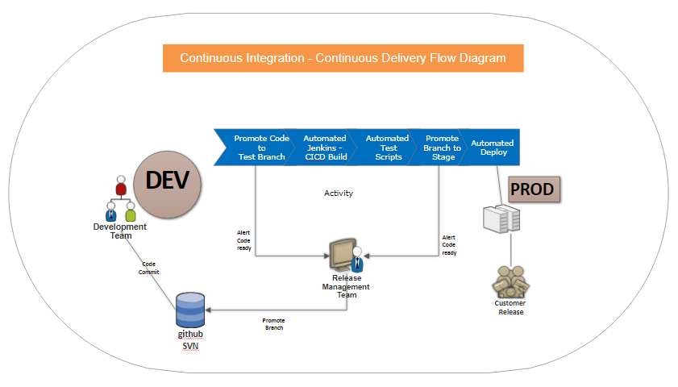

Microservice Architecture (Load balanced + High availability)
=============================================================

Microservice is a very abused term and Microservices are not supposed to be Micro in size. However they have the capability to be Micro, in case of a complete CICD requirement. Be warned this comes with a very high hardware price and automated testing overhead and fulfillment of complete Microservice independence requirement. Complete independence means, a database per Microservice. 

A better design is split Microservices per large homogeneous entity relationship. Eg: Order Entry System in one Microservice, Product Catalog and Inventory Management in another Microservice. Making Product Description iteself an independent microservice in Netflix model and provides ease of independent deployment and speed to market, but it involves large infrastructure. Each tiny Microservice  will have to run in it's own docker container.

# Realistic Microservice design and achieving enviable performance

The minimal mode allows us to scale our deployments properly. Splitting ,icroservices properly allows to scale the busier portions to more instances and scale up and down as per load and achieve cost effectiveness on hardware, as well as high availability, fault tolerance. This is the real use of Microservices architecture.

The components of this design are

[Spring Eureka Server](MLEurekaServer/README.md)

Please click the link above for details. This server manages our service registry and discovery. Our Microservices registers with Eureka servers. The consumer applciations and ZUUL proxy queries Eureka server for discovery.
  
[Spring Boot Microservice](MLService/README.md)
  
Please click the link above for details. This is the Microservice implementation project. For demonstartion sake, one Microservice here calls another microservice. However the call is made through service discovery. Hence it demonstrates load balancing concept clearly. If you run the application, the output traces port number and it will show you that the server is calling through load balancer.

[Spring Zipkin Server](ZipkinServer/README.md)
  
  Please click the link above for details. Zipkin server logs all the service calsl and maintains traceid for one set of service calls, that are part of same call. This could come handy debugging performance or other issues.
  
[Zuul Proxy](MSApiGateway/README.md)
  
  Please click the link above for details. The idea is to implement an API Gateway. Why Gateway, several Microservices can be tailored to one API gateway and load balancing can never go wrong when a service is consumed via a gateway, plus security can be implemented easily hiding microservices behind a DMZ zone.
  
[Hystrix Circuit Breaker](MLService/README.md)
  
  Please click the link above for details. This area shows how we can avoid cascading failures and avoid certain circuit paths by resolving to return failure.

# Happy coding!

Good Luck and spend time and code slow. It is not the size of the docker ship, it is the motion in the ocean - Santhosh 

## Contribute

* Fork the project
* Create a feature branch based on the 'master' branch
* Create a PR and feel proud.

## License

MicroServicesArchitecture is released under the MIT license, see [LICENSE](https://github.com/BonifyByForteil/react-native-piwik/blob/master/LICENSE).

`# Microservices Architecture`
`# Microservices`
